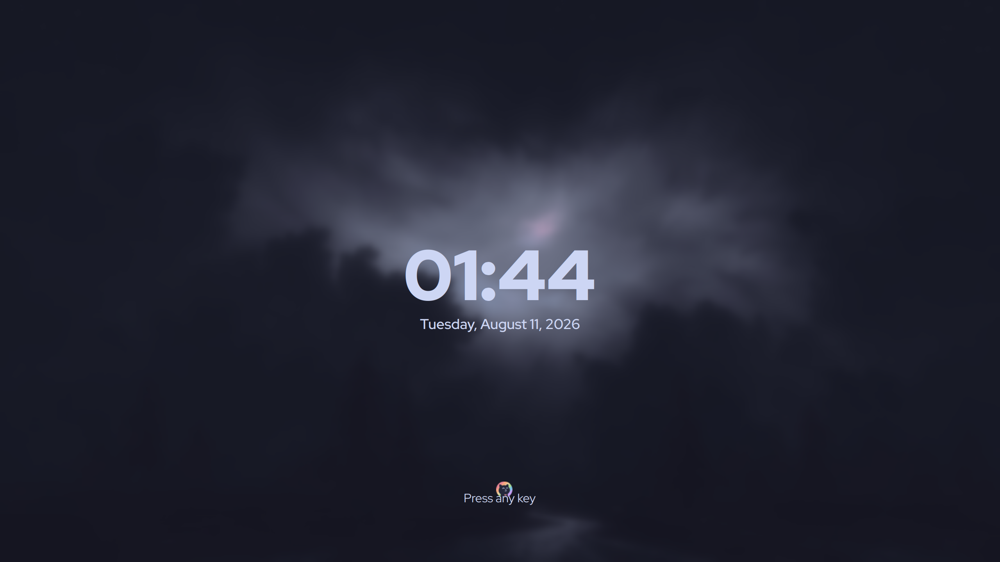
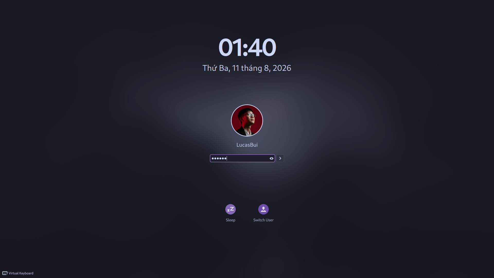
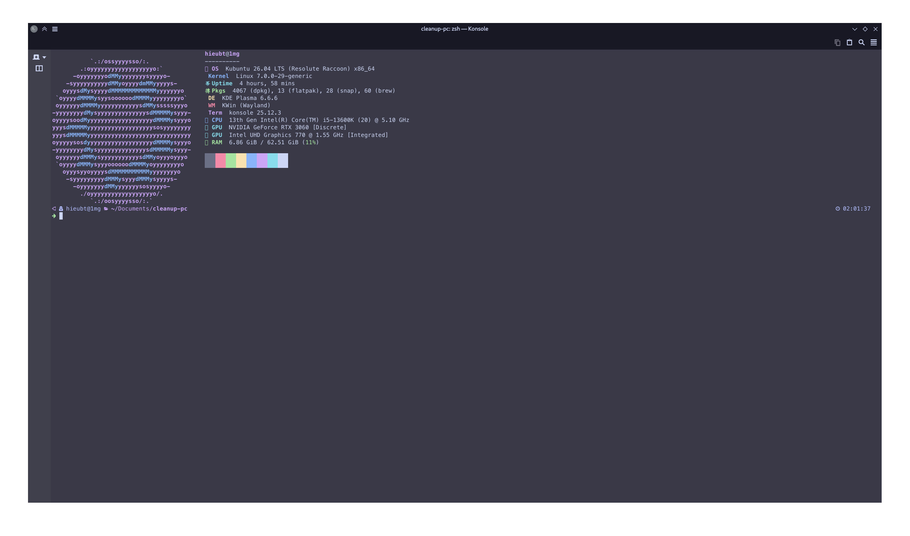
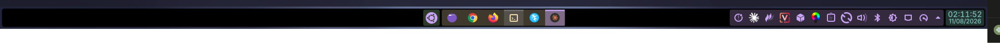

# 🌸 Kubuntu Catppuccin Rice — Mocha Mauve

A complete **Catppuccin Mocha (Mauve accent)** desktop for **Kubuntu 26.04 / KDE Plasma 6.6 (Wayland)** — every surface themed: windows, panels, terminal, editor, login screen, lock screen, boot splash and GRUB.


## ✨ What's themed

| Surface | What | Source |
|---|---|---|
| Qt widgets | Kvantum `catppuccin-mocha-mauve` + translucency & blur | [catppuccin/kvantum] + tweaks |
| Colors | `CatppuccinMochaMauve` color scheme | [catppuccin/kde] |
| Icons | Tela-circle purple dark | [vinceliuice/Tela-circle-icon-theme] |
| Cursors | Catppuccin Mocha Mauve | [catppuccin/cursors] |
| GTK 3/4 | catppuccin-mocha-mauve-standard | [catppuccin/gtk] |
| Window deco | Breeze (follows color scheme) + rounded corners everywhere | [KDE-Rounded-Corners] |
| KWin effects | blur 12, wobbly windows, magic lamp, scale, sheet, cube, dim screen | built-in |
| Panels | Floating auto-hide top bars (both screens) + Win11-style floating taskbar with [Panel Colorizer] (custom *Bliss Mocha* preset) | `plasma/panels-v5.js` |
| Monitors | Synced pie charts CPU / RAM / GPU + compact ↓↑ network numbers | built-in system monitor |
| SDDM | [SilentSDDM] `catppuccin-mocha` preset — custom background, mauve accent, real avatar, small password dots | `sddm/` |
| Lock screen | Custom look-and-feel `org.kde.catppuccin.lock` — smaller password dots, blurred wallpaper matching SDDM | `plasma/look-and-feel/` |
| Terminal | Konsole/Yakuake mocha scheme (88% opacity + blur), fastfetch, powerlevel10k mocha palette | `terminal/` |
| Editor | Kate "Catppuccin Mocha" (bundled with KF6), VS Code Catppuccin ext | `kde/katerc` |
| Boot | GRUB [catppuccin/grub] + Plymouth [catppuccin/plymouth] | `scripts/` |
| Font | Inter (UI), monospace untouched | `fonts-inter` |

| | |
|---|---|
|  |  |
|  |  |


## 📦 Layout

```
kvantum/    Kvantum theme (translucent_windows=true, reduce_window_opacity=15)
kde/        kdeglobals, kwinrc, kscreenlockerrc, katerc (reference copies)
plasma/     panels-v5.js (rebuilds both bars via plasma scripting API),
            appletsrc + plasmashellrc reference, custom lockscreen LnF,
            Panel Colorizer "Bliss Mocha" preset JSON
sddm/       SilentSDDM config (mocha + mauve + custom bg) + sddm settings
terminal/   Konsole scheme & profile, fastfetch config, p10k color overrides
gtk/        GTK3 settings reference
icons/      Mauve-recolored Ubuntu start button (SVG)
scripts/    Root-side install scripts (SDDM, GRUB, Plymouth, avatar)
screenshots/
```

## 🚀 Install (high level)

> Tested only on Kubuntu 26.04 + Plasma 6.6. **Read the scripts before running them.** Everything user-side lives in `~/.config` / `~/.local` and is reversible.

1. **Base themes** — install [catppuccin/kvantum], [catppuccin/kde] color scheme, [catppuccin/cursors], Tela-circle icons, [catppuccin/gtk], then copy `kvantum/` over `~/.config/Kvantum/` for the translucency tweaks. Apply with:
   ```bash
   kvantummanager --set catppuccin-mocha-mauve
   plasma-apply-colorscheme CatppuccinMochaMauve
   plasma-apply-cursortheme catppuccin-mocha-mauve-cursors
   /usr/lib/x86_64-linux-gnu/libexec/plasma-changeicons Tela-circle-purple-dark
   ```
2. **Panels** — install [Panel Colorizer], then run `plasma/panels-v5.js`:
   ```bash
   qdbus6 org.kde.plasmashell /PlasmaShell org.kde.PlasmaShell.evaluateScript "$(cat plasma/panels-v5.js)"
   ```
3. **Rounded corners** — build [KDE-Rounded-Corners] (needs `kwin-dev`, `qt6-base-private-dev`, `libkf6kcmutils-dev`), then:
   ```bash
   kwriteconfig6 --file kwinrc --group Plugins --key kwin4_effect_shapecornersEnabled true
   ```
4. **Lock screen** — copy `plasma/look-and-feel/org.kde.catppuccin.lock` to `~/.local/share/plasma/look-and-feel/` and set:
   ```bash
   kwriteconfig6 --file kscreenlockerrc --group Greeter --key Theme org.kde.catppuccin.lock
   ```
5. **SDDM / GRUB / Plymouth** — install [SilentSDDM], copy `sddm/silent-catppuccin-mocha.conf` over its `configs/catppuccin-mocha.conf`, then adapt the scripts in `scripts/` (they contain absolute paths for my machine — edit before use). SDDM needs the cursor theme copied to `/usr/share/icons` and the user avatar at `/usr/share/sddm/faces/<user>.face.icon`.
6. **Terminal** — copy `terminal/catppuccin-mocha.colorscheme` to `~/.local/share/konsole/`, set it in your profile, drop `terminal/fastfetch.jsonc` at `~/.config/fastfetch/config.jsonc`, and source/append `terminal/p10k-catppuccin-overrides.zsh` at the end of `~/.p10k.zsh`.

## 🎨 Palette

Catppuccin **Mocha**, accent **Mauve** `#cba6f7` — base `#1e1e2e`, surface `#313244`, text `#cdd6f4`, blue `#89b4fa`, green `#a6e3a1`, peach `#fab387`, teal `#94e2d5`.

## 🙏 Credits

- [Catppuccin](https://github.com/catppuccin) — the soothing pastel theme (kvantum, kde, gtk, cursors, grub, plymouth, konsole, browsers)
- [uiriansan/SilentSDDM](https://github.com/uiriansan/SilentSDDM) — the gorgeous Qt6 SDDM theme
- [matinlotfali/KDE-Rounded-Corners](https://github.com/matinlotfali/KDE-Rounded-Corners) — rounded corners KWin effect
- [luisbocanegra/plasma-panel-colorizer](https://github.com/luisbocanegra/plasma-panel-colorizer) — panel styling engine
- [vinceliuice/Tela-circle-icon-theme](https://github.com/vinceliuice/Tela-circle-icon-theme) — icon theme
- [orangci/walls-catppuccin-mocha](https://github.com/orangci/walls-catppuccin-mocha) — wallpapers (`galaxy-waves`, `purple-horizon`, `purpled-night`) — grab them from that repo

## 📄 License

My own scripts and configs: MIT. Third-party themes keep their upstream licenses (see Credits).

[catppuccin/kvantum]: https://github.com/catppuccin/kvantum
[catppuccin/kde]: https://github.com/catppuccin/kde
[catppuccin/cursors]: https://github.com/catppuccin/cursors
[catppuccin/gtk]: https://github.com/catppuccin/gtk
[catppuccin/grub]: https://github.com/catppuccin/grub
[catppuccin/plymouth]: https://github.com/catppuccin/plymouth
[vinceliuice/Tela-circle-icon-theme]: https://github.com/vinceliuice/Tela-circle-icon-theme
[KDE-Rounded-Corners]: https://github.com/matinlotfali/KDE-Rounded-Corners
[Panel Colorizer]: https://github.com/luisbocanegra/plasma-panel-colorizer
[SilentSDDM]: https://github.com/uiriansan/SilentSDDM
